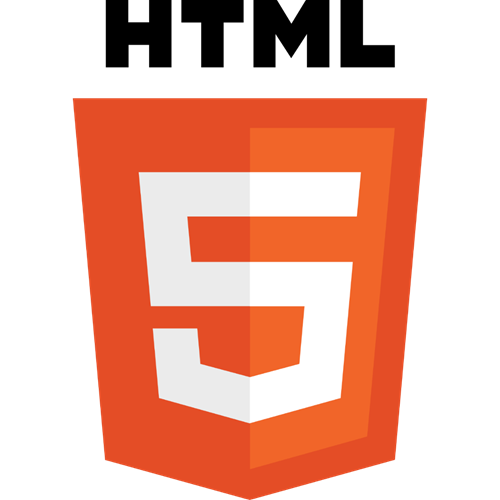

# THEORIE VON HTML, PPEDV EDITION

ppedv AG, Vadzim Naumchyk

<!--  -->

## HTML > GETTING STARTED

<!-- #region IDEA -->

### HTML > GETTING STARTED > IDEA OF HTML

WAS IST HTML

- Hyper Text Markup Language
- Dokumentenbeschreibungsprache (Auszeichnungssprache)
- basiert auf XML
- Aktuelle Version: Living Standard (Versionierung in Mai 2019 aufgehoben)

WOZU IST HTML

- eine schnelle Alternative, UI-Elemente für browserbasierte Apps anzulegen
- Zuständig für die Struktur der Seite

<!-- 
IN-COURSE REMARKS
Hypertext ist ein Text, der nicht linear sein muss (not constrained to be linear).
Hypertext ist ein Text, der Links zu anderen Texten enthält.
HyperMedia ist ein Hypertext, der auch Grafiken, Videos oder Klänge enthalten kann (not constrained to be text).
Hypertext und HyperMedia sind Konzepte, keine Produkte.
https://de.wikipedia.org/wiki/Hypertext
 -->
<!-- #endregion -->
<!-- #region LINKS -->

### HTML > GETTING STARTED > LINKS

OFFIZIELLE QUELLEN

- HOMEPAGE <https://html.spec.whatwg.org/>
- DOCS <https://html.spec.whatwg.org/dev/>
- BLOG <https://blog.whatwg.org/>
- CODE <https://github.com/whatwg/html>

<!-- 
*todo
ist code auf github nicht die Webseite? -->
<!--
https://developer.mozilla.org/de/docs/Web/HTML
MDN DOCS zu HTML
https://www.w3schools.com/
HTML TUTORIALS
http://html5test.com
Html5test: zeigt wie gut mein Browser HTML5 unterstützt.
http://validator.w3.org/
Validator: Überprüft das Markup (HTML, XHTML, ...) von Webdokumenten.
https://www.w3.org/html/
Grammatikkenner
 -->

<!-- #endregion -->

<!-- #region TOOLS -->

### HTML > GETTING STARTED > TOOLS

- VSCode
- VSCode Erweiterungen
  - open in browser
  - auto rename tag
  - live server (auto update für Änderungen)

<!-- #endregion -->

<!-- #region LAB -->

### HTML > GETTING STARTED > LAB

[zurück zu ABLAUF.md](../ABLAUF.md#m01--html-getting-started)

<!-- #endregion -->

## HTML > SYNTAX

<!-- #region TAGS -->

### HTML > SYNTAX > TAGS

Von der Syntax her gibt es 5 Arten von HTML-Tags:

1. Doctype-Tag `<!DOCTYPE>`
2. Start-Tag aus einem Tag-Paar `<button>`
3. End-Tag aus einem Tag-Paar `</button>`
4. ein alleinstehender Tag ` ` oder ` ` (Version HTML4) oder einfach ` ` (Version HTML5, so wie ein Start-Tag)
5. Kommentar-Tag `<!-- kommentar vom web-entwickler -->` (auch quasi alleinstehend)

Obwohl ein Start-Tag und ein End-Tag zwei Tags sind, werden sie zusammen auch einfach nur als HTML-Tag genannt. Z.B. das Paar `

` werden als p-Tag bezeichnet. Die Mehrheit von HTML-Tags sind Tagspaare. Alleinstehende Tags sind etwas seltener. Und Doctype-Tag trifft man nur einmal pro eine HTML-Datei.

<!-- #endregion -->
<!-- #region CONTENT -->

### HTML > SYNTAX > TAG-CONTENT, STRINGS, ENTITIES

Ein Tag-Paar besteht aus zwei Teilen, um dazwischen noch irgendwelchen Inhalt einzuschließen. Welcher Inhalt es ist, hängt vom jeweiligen Tag ab. Meistens sieht man als Inhalt Text (String) oder weitere HTML-Tags.

Wenn es String ist, dann sind hier alle Zeichen ohne Bedenken zu benutzen außer diejenigen, die für HTML-Parser von besonderer Bedeutung sind. Und nämlich die spitzen Klammern. Mit denen muss man vorsichtig sein, nicht dass ein neuer unerwünschter Tag angelegt wird.

Will man aber genau die spitzen Klammern im Browser rendern lassen, kann man Sign-Entities benutzen. Vllt kennt das jemand auch aus Word. Z.B. `&lt;` wird gerendert als `<`.

Weitere Informationen direkt in html-syntax.html, damit Du die Code-Beispiele auch direkt austesten kannst.

[zurück zu ABLAUF.md](../ABLAUF.md#m04--html-syntax)

<!-- #endregion -->
